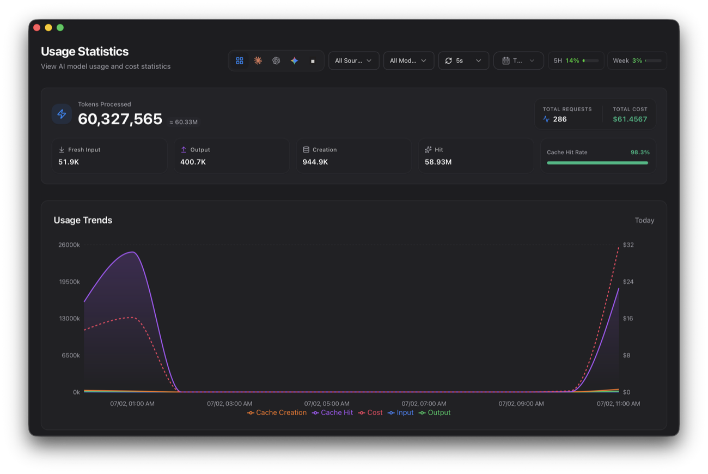
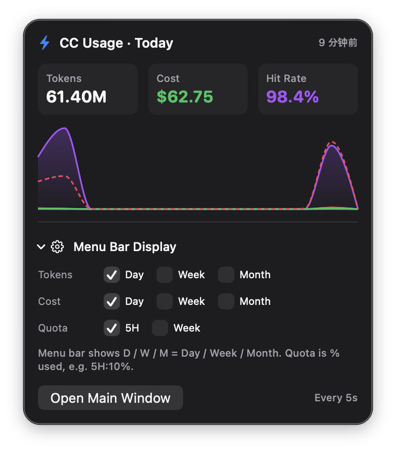

<div align="center">

# CC Usage

**macOS 菜单栏里的 Claude Code / Codex / Gemini 用量实时看板**

基于 [cc-switch](https://github.com/farion1231/cc-switch) Usage 面板二次开发的原生伴侣应用

简体中文 | [English](README.en.md)


</div>

---

## 这是什么

[cc-switch](https://github.com/farion1231/cc-switch) 的「用量统计」面板很好用,但它藏在主程序的一个标签页里。CC Usage 把它搬出来**常驻**:

- **菜单栏码片**:今日 tokens·花费、5H/Week 官方订阅额度百分比,一眼可见,5 秒实时刷新;
- **独立主窗口**:内嵌 cc-switch **真实前端**(不是仿制)的完整 Usage 面板,数字、图表、交互与原版逐像素一致。

<div align="center">

<br><br>

</div>

## 功能

- ⚡ **菜单栏码片自由组合**:今日 / 近 7 天 / 近 30 天的 Tokens 与花费(D/W/M),外加 5H / Week 官方额度百分比,想看哪个勾哪个
- 📊 **1:1 真面板**:主窗口直接运行 cc-switch 前端构建产物——Usage Hero、真 Recharts 趋势图(悬停提示与原版一致)、来源/模型筛选、日期范围、Request Logs / Provider Stats / Model Stats 三个标签页
- 🔄 **5 秒实时刷新**:间隔可选 5/10/30/60 秒或关闭,选择持久化;菜单栏与主窗口共享同一个刷新节奏,数字永远一致
- 🔋 **官方订阅额度**:读取本机 Claude Code 的 OAuth 凭据查询官方 `/api/oauth/usage`,5 分钟节流 + 进程内共享缓存,绝不打爆接口(429);首屏即显,无需等待
- 🔌 **cc-switch 关闭也照常实时**:内置只读「未入库增量」叠加层,直接增量解析 Claude Code 会话日志并按 cc-switch 的价格表现场定价;cc-switch 补录入库时自动去重收敛,实测数字无缝交接
- 🪟 **克制的窗口行为**:主窗口全局唯一,关掉后菜单栏继续常驻

## 前置条件(必读)

> [!IMPORTANT]
> 1. **macOS 14 (Sonoma) 及以上**;
> 2. 已安装 [cc-switch](https://github.com/farion1231/cc-switch)(建议 ≥ 3.16)——历史数据、价格表与数据库都由它建立维护,本应用对其库**只读**;
>    **cc-switch 不需要保持运行**:它关闭时,应用会直接增量解析 Claude Code 的会话日志(`~/.claude/projects`),把尚未入库的用量实时叠加显示,等 cc-switch 回来补录时按 request_id 精确去重、无缝交接不双算(Codex / Gemini 的**新增**用量仍需 cc-switch 运行导入);
> 3. 额度徽标(5H/Week)需要本机登录过 Claude Code(从 Keychain / `~/.claude/.credentials.json` 读取 OAuth 凭据)。

## 安装

### 方式一:下载 Release(推荐)

1. 从 [Releases](https://github.com/Eureka0w0v0/cc-usage/releases) 下载 `CC.Usage.app.zip` 并解压;
2. 把 `CC Usage.app` 拖进「应用程序」;
3. 应用是 ad-hoc 签名(个人开源项目,没有付费开发者证书),首次打开前需要去掉隔离属性:

```bash
xattr -d com.apple.quarantine "/Applications/CC Usage.app"
```

### 方式二:源码构建

需要完整 Xcode 与 [XcodeGen](https://github.com/yonaskolb/XcodeGen)(`brew install xcodegen`):

```bash
git clone https://github.com/Eureka0w0v0/cc-usage.git
cd cc-usage
bash scripts/build.sh   # 生成工程 → Release 构建 → 安装到 /Applications 并启动
```

## 使用说明

- **菜单栏显示项**:点菜单栏 ⚡ 图标 → 展开「Menu Bar Display」→ 勾选想要的码片(Tokens/Cost 各含 Day/Week/Month,Quota 含 5H/Week)。菜单栏显示格式如 `D: 42.9M·$34.9 5H: 10%`;
- **刷新间隔**:主窗口工具栏的 ⟳ 下拉选择,菜单栏与面板同步生效并持久化;
- **额度的更新节奏**:5H/Week 的百分比**最快 5 分钟变一次**——官方接口按 cc-switch 同款设计做了 5 分钟节流,防止账号被限流。本地库的 tokens/花费才是真·5 秒一变;
- **日期/来源/模型筛选、三个统计标签页**:与 cc-switch 原版完全一致。

## 工作原理

```
┌────────────────────────── CC Usage.app ──────────────────────────┐
│                                                                  │
│  菜单栏码片 + 弹窗 (SwiftUI)          主窗口 (WKWebView)          │
│        │                                │                        │
│        │                        cc-switch 真前端单文件 bundle     │
│        │                        (embed/ 桥接入口编译产物)         │
│        │                                │ invoke(cmd, args)      │
│        ▼                                ▼                        │
│  ┌──────────────────── Swift 数据层 ─────────────────────┐        │
│  │ UsageStore     → 只读 ~/.cc-switch/cc-switch.db        │        │
│  │ SessionOverlay → 直读 ~/.claude/projects 会话 JSONL     │        │
│  │                  (cc-switch 尚未入库的增量,内存叠加)   │        │
│  │ QuotaCache     → 官方 /api/oauth/usage,5 分钟节流      │        │
│  └───────────────────────────────────────────────────────┘        │
└──────────────────────────────────────────────────────────────────┘
        ▲ 库的写入方始终只有 cc-switch(历史归档 + Codex/Gemini 导入)
```

- 主窗口不是仿制界面,而是把 cc-switch 的前端源码加一层 `invoke` 桥接(`embed/`)后用 Vite 编译成单文件 `index.html`,跑在 WKWebView 里;前端发出的 Tauri `invoke` 调用被 Swift 拦下,直接查本地 SQLite 返回——统计口径逐条复刻 cc-switch 的 `usage_stats.rs`;
- cc-switch 不在运行时,`SessionOverlay` 按 cc-switch 记录的行偏移(`session_log_sync`)只读续解析会话 JSONL,解析与定价规则逐条对齐其导入器(`session_usage.rs`);这些「未入库增量」在内存里并进所有查询,cc-switch 回来入库时按 `request_id` 精确去重、自动收敛为零——全程不写库,绝无双算;
- 订阅额度走你本机的 Claude Code OAuth 凭据,查询结果在进程内共享缓存,菜单栏与面板读同一份,所以两边永远一致。

## 重建面板前端(可选)

仓库已内置编译好的 `Sources/App/web-panel/index.html`,普通构建**不需要**这一步。cc-switch 上游更新后想跟进面板时:

```bash
git clone https://github.com/farion1231/cc-switch ../cc-switch   # 或指向你已有的 clone
CC_SWITCH_DIR=../cc-switch bash scripts/build-embed.sh
```

脚本会把 `embed/` 下的桥接文件(全部为新增文件,不改动上游任何文件)铺进 cc-switch 源码树,用 pnpm + Vite 构建单文件面板并写回本仓库。

## 隐私

- 所有用量数据**只在本机**:只读 cc-switch 的 SQLite 库,不上传任何内容;
- 唯一的网络请求是 Anthropic 官方额度接口 `api.anthropic.com/api/oauth/usage`(仅在勾选额度码片/徽标时,5 分钟最多一次);
- OAuth 凭据仅在本机读取使用,不落盘、不外发。

## 致谢与许可

- 本项目是 [cc-switch](https://github.com/farion1231/cc-switch)(MIT, © [@farion1231](https://github.com/farion1231))的二次开发:主窗口面板由其前端源码直接构建,统计口径与其后端逐条对齐。感谢原作者的优秀工作;
- 本项目以 [MIT](LICENSE) 许可开源,随附的第三方代码声明见 [THIRD_PARTY_NOTICES.md](THIRD_PARTY_NOTICES.md)。
